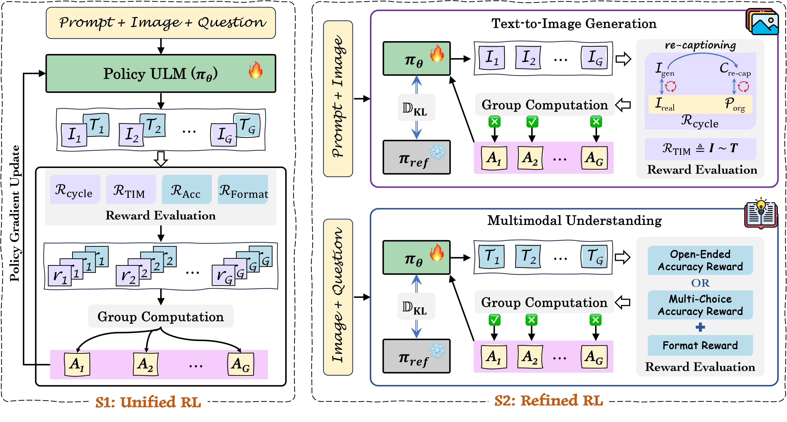
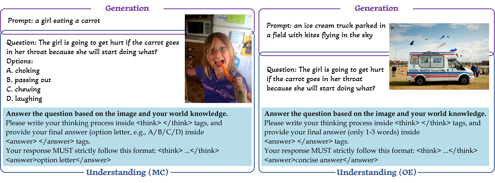

<div align="center">
<h1> Co-Reinforcement Learning for<br>Unified Multimodal Understanding and Generation</h1>

[](https://www.arxiv.org/abs/2505.17534) 
[](https://github.com/mm-vl/ULM-R1) 
[](https://huggingface.co/collections/mm-vl/corl-67e0f23d6ecbdc3a9fb747e9) 

</div>

## Introduction

CoRL is a GRPO-based RL framework designed to simultaneously enhance the generation and understanding capabilities of ULMs within a shared policy optimization paradigm. It comprises a unified RL stage for joint optimization and a refined RL stage for task-specific enhancement. 

<p align="center">
   
</p>

## 📢 Latest Updates

- [2025-06-25] 📌 Code of [TTRL](./ttrl) for MM2T and T2I.
- [2025-06-01] 📌 Core code of [CoRL](./corl).

## Environment 

```bash
git https://github.com/mm-vl/ULM-R1.git
cd ULM-R1
conda create -n corl python=3.10 -y
conda activate corl
pip install -e .
pip install flash-attn --no-build-isolation
# pip install flash-attn --no-build-isolation --use-pep517
```
> Pls refer to [install.md](Install.md) for more details.

## Training Data

- [Stage I: unified RL data](https://huggingface.co/datasets/mm-vl/x2x_rft_22k), with ~70\% concept coverage.
<p align="center">
   
</p>

- [Stage II: refined RL data for text-to-image](https://huggingface.co/datasets/mm-vl/x2x_rft_16k)
- [Stage II: refined RL data for multimodal understanding (MC-Format)](https://huggingface.co/datasets/mm-vl/mcot_r1_mcq_66k)
- [Stage II: refined RL data for multimodal understanding (OE-Format)](https://huggingface.co/datasets/mm-vl/mcot_r1_vqa_66k)


## Training Pipeline

- Unified RL 

```shell
bash corl/scripts/corl_unified.sh
```

---
## Test-Time Reinforcement Learning (TTRL)

We simply adapt the [TTRL](https://github.com/PRIME-RL/TTRL) algorithm to multimodal understanding and text-to-image generation, aiming to explore the potential of RL in enhancing both understanding and generation performance at inference time. 

>[!Tip] 
>required: trl>=0.18.1

### multimodal understanding

```shell
bash ttrl/scripts/mm2t_mmmu.sh
bash ttrl/scripts/mm2t_mmstar.sh
```
|              | MMMU | MMStar |
|:------------:|:----:|:------:|
| Janus-Pro-1B | 36.3 |  43.1  |
|    + TTRL    | 39.8 |        |

### text-to-image generation
```shell
bash ttrl/scripts/t2i_geneval.sh
bash ttrl/scripts/t2i_unieval.sh
```
|              | GenEval | UniEval (UniScore) |
|:------------:|:-------:|:------------------:|
| Janus-Pro-1B |  0.73   |       0.370        |
|    + TTRL    |  0.76   |       0.455        |


## Acknowledgement

[Janus-Pro](https://github.com/deepseek-ai/Janus) | [open-r1-multimodal](https://github.com/EvolvingLMMs-Lab/open-r1-multimodal) | [R1-V](https://github.com/Deep-Agent/R1-V)
